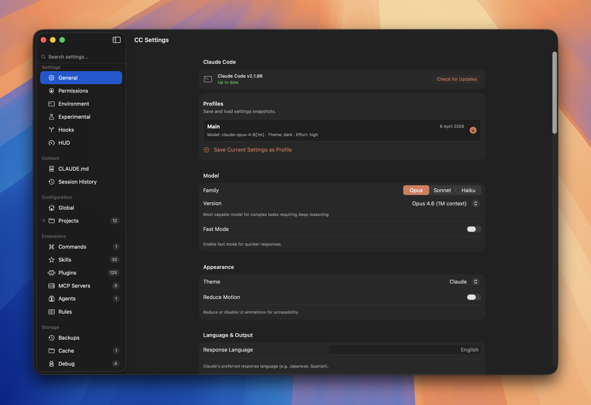

# CC Settings

A native macOS app for managing Claude Code configuration — settings, permissions, hooks, plugins, MCP servers, sessions, and more. No more hand-editing JSON files.

[](LICENSE)
[](https://github.com/Rektoooooo/CC-Settings/stargazers)
[](https://github.com/Rektoooooo/CC-Settings)
[](https://github.com/Rektoooooo/CC-Settings)

<!--  -->

## Install

**Requirements:** macOS 26.0+, Xcode 16+, [XcodeGen](https://github.com/yonaskolb/XcodeGen)

```bash
git clone https://github.com/Rektoooooo/CC-Settings.git
cd CC-Settings
xcodegen generate
open "CC Settings.xcodeproj"
```

Build and run with `Cmd+R` in Xcode.

---

## What is CC Settings?

Claude Code stores its configuration across multiple JSON files, markdown docs, and folders under `~/.claude/`. CC Settings gives you a native macOS GUI to manage all of it — with instant saves, search, and visual editors.

| What You Get | Why It Matters |
|---|---|
| **Visual settings editor** | No more hand-editing `settings.json` with typos |
| **Permission matrix** | See and control tool permissions at a glance |
| **Hook builder** | Create pre/post hooks with matcher patterns visually |
| **Session browser** | Browse full conversation history with tool calls and thinking blocks |
| **Plugin manager** | Browse marketplaces, view plugin details, copy install commands |
| **MCP server config** | Add/edit/remove MCP servers with a form instead of JSON |
| **Git integration** | Stage, commit, diff, push/pull — all built in |
| **Global search** | Find any setting instantly across all sections |

---

## Sections

### Settings

| Section | What It Does |
|---|---|
| **General** | Model selection, appearance, language, effort level, git config, notifications, auto-compact, attribution |
| **Permissions** | Default permission mode, per-tool permissions (Bash, Read, Write, Edit, Glob, Grep, etc.), custom pattern rules, additional directories |
| **Environment** | API keys, model overrides, proxy settings, output tokens, thinking tokens, prompt caching, MCP timeouts |
| **Experimental** | Extended thinking with budget slider, agent teams, sandbox config, spinner customization, telemetry controls |
| **Hooks** | Pre/Post Tool Use, Pre/Post Prompt Submit — each with optional matchers and multiple commands |
| **HUD** | Configure the [claude-hud](https://github.com/jarrodwatts/claude-hud) statusline plugin — layout, display toggles, usage thresholds, git status, presets, with live ASCII preview |

### Content

| Section | What It Does |
|---|---|
| **CLAUDE.md** | Edit global and per-project CLAUDE.md files with source/preview/split view and template system |
| **Session History** | 3-column browser: projects → sessions → messages with tool use visualization, thinking blocks, and search |

### Extensions

| Section | What It Does |
|---|---|
| **Commands** | Browse, create, and edit slash commands with frontmatter metadata and markdown body |
| **Skills** | Browse skills with multi-file viewer (markdown, JSON, code, PDF) |
| **Plugins** | Browse marketplace plugins grouped by source, view READMEs, copy install commands |
| **MCP Servers** | Add/edit/remove Model Context Protocol servers (stdio and SSE transports) |

### Folders

| Section | What It Does |
|---|---|
| **Files** | Browse global and per-project Claude Code files with type-aware viewers |
| **Dynamic Folders** | Auto-discovered subfolders (plans, tasks, todos, backups, debug, file-history, etc.) with item counts |

### Maintenance

| Section | What It Does |
|---|---|
| **Cleanup** | Storage dashboard with charts, filter by age, bulk-delete old projects and sessions |
| **Version Control** | Built-in git: status, staging, commits, history, diffs, pull/push, repo initialization |

---

## How It Works

CC Settings reads and writes the same files Claude Code uses:

```
~/.claude/settings.json          ← General, Permissions, Hooks, Experimental
~/.claude/settings.local.json    ← Environment variables
~/.claude/.env                   ← API keys and env flags
~/.claude/CLAUDE.md              ← Global instructions
~/.claude/commands/*.md          ← Slash commands
~/.claude/skills/                ← Skills
~/.claude/plugins/               ← Plugins + HUD config
~/.claude.json                   ← MCP servers
~/.claude/projects/              ← Per-project settings & sessions
```

Every toggle, picker, and text field saves immediately — no Save button needed. Changes are picked up by Claude Code on the next prompt.

---

## Features

### Global Search
Search across all settings sections from the sidebar. Matches setting names, keywords, and descriptions.

### Live Previews
- **CLAUDE.md** — Rendered markdown preview side-by-side with source
- **HUD** — ASCII preview updates as you toggle options
- **Diffs** — Visual diff viewer for git changes

### Session Browser
Browse your full conversation history:
- Filter by project, search within messages
- See tool use calls with arguments and results
- View extended thinking blocks
- Session metadata: duration, models, tools used

### Permission Matrix
Visual grid of all Claude Code tools with allow/deny/ask states. Add custom pattern-based rules like `Bash(git push *)` or `Read(.env)`.

### Hook Builder
Create hooks with:
- **Event type** — Pre/Post Tool Use, Pre/Post Prompt Submit
- **Matchers** — Optional tool name and regex pattern filters
- **Commands** — One or more shell commands to execute

### HUD Configuration
Native UI for the [claude-hud](https://github.com/jarrodwatts/claude-hud) statusline plugin:
- Toggle display elements (context bar, usage, tools, agents, todos, git)
- Adjust usage thresholds with sliders
- Apply presets (Full / Essential / Minimal)
- Live ASCII preview shows exactly what the HUD will look like

### Built-in Git
Full git workflow without leaving the app:
- View status, stage files, write commit messages
- Browse commit history with file-level diffs
- Pull and push to remotes
- Initialize repos for untracked directories

---

## Development

```bash
# Clone
git clone https://github.com/Rektoooooo/CC-Settings.git
cd CC-Settings

# Generate Xcode project
brew install xcodegen    # if not installed
xcodegen generate

# Open and build
open "CC Settings.xcodeproj"
```

### Project Structure

```
CC Settings/
├── App/                    # App entry point, ContentView
├── Models/                 # Data models (ClaudeSettings, Project, etc.)
├── Services/               # ConfigurationManager, FileWatcher
├── Views/
│   ├── General/            # General settings
│   ├── Permissions/        # Permission matrix
│   ├── Environment/        # Environment variables
│   ├── ExperimentalFeatures/
│   ├── Hooks/              # Hook builder
│   ├── HUD/                # HUD plugin config
│   ├── ClaudeMD/           # CLAUDE.md editor
│   ├── Sessions/           # Session history browser
│   ├── Commands/           # Slash commands
│   ├── Skills/             # Skills browser
│   ├── Plugins/            # Plugin marketplace
│   ├── MCPServers/         # MCP server config
│   ├── Cleanup/            # Storage cleanup
│   ├── Sync/               # Version control
│   ├── Content/            # File browser
│   ├── FileViewers/        # Type-aware file viewers
│   └── Sidebar/            # Navigation sidebar
└── Resources/              # Info.plist, entitlements, assets
```

### Dependencies

- [swift-markdown](https://github.com/apple/swift-markdown) — Markdown parsing and rendering

---

## License

MIT — see [LICENSE](LICENSE)

---

## Star History

[](https://star-history.com/#Rektoooooo/CC-Settings&Date)
