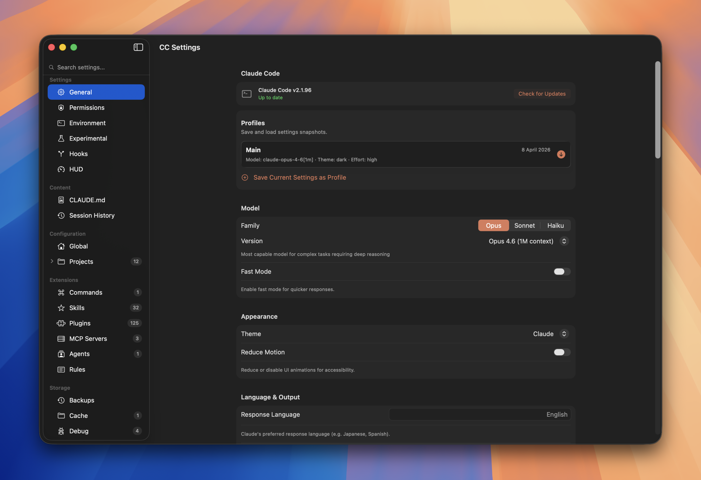

<div align="center">
  <h1>&nbsp; CC Settings</h1>
  <p><strong>A native macOS app for managing Claude Code configuration.</strong><br>Settings, profiles, permissions, hooks, MCP servers, sessions, and more — no more hand-editing JSON.</p>
  <p>
    <a href="https://github.com/Rektoooooo/CC-Settings/releases/latest"></a>
    <a href="https://github.com/Rektoooooo/CC-Settings"></a>
    <a href="https://github.com/Rektoooooo/CC-Settings"></a>
    <a href="https://github.com/Rektoooooo/CC-Settings/stargazers"></a>
    <a href="LICENSE"></a>
  </p>
</div>



## Install

### Download (recommended)

Grab the latest DMG from [**Releases**](https://github.com/Rektoooooo/CC-Settings/releases/latest), open it, and drag CC Settings to your Applications folder. The app is **code-signed and notarized by Apple** — it opens normally, no Gatekeeper warning.

### Build from source

Requires macOS 26.0+, Xcode 16+, and [XcodeGen](https://github.com/yonaskolb/XcodeGen).

```bash
git clone https://github.com/Rektoooooo/CC-Settings.git
cd CC-Settings
xcodegen generate
open "CC Settings.xcodeproj"   # Cmd+R to build and run
```

---

## Why CC Settings?

Claude Code stores its configuration across JSON files, markdown docs, and folders under `~/.claude/`. CC Settings gives you a native macOS UI to manage all of it.

- **Every change writes only the field you touched** — the app never overwrites your other settings
- **Instant saves** — no save button, changes are picked up by Claude Code on the next prompt
- **Settings Profiles** — save and load named configuration snapshots
- **Per-project overrides** — customize model, permissions, hooks, and more per project with inherit/override toggles
- **Global search** — find any setting instantly across all sections

---

## Features

### Settings

| Section | Highlights |
|---|---|
| **General** | Model family/version picker, profiles, theme, language, effort level, git config, auto-compact, attribution, and more |
| **Permissions** | Visual permission matrix for all tools, custom pattern rules (e.g. `Bash(git push *)`), default mode picker |
| **Environment** | API keys, model overrides, proxy settings, token limits, prompt caching toggles, MCP timeouts |
| **Experimental** | Extended thinking with budget slider, agent teams, sandbox config (new + legacy), spinner customization, status line |
| **Hooks** | Pre/Post Tool Use, Prompt Submit, and 20+ other hook types — with matchers, multiple commands, and scope badges |
| **HUD** | Configure the [claude-hud](https://github.com/jarrodwatts/claude-hud) statusline — layout, toggles, thresholds, presets, live ASCII preview |

### Profiles

Save your current settings as a named profile and switch between them. Profiles store the full raw JSON, so unknown CLI keys are preserved. Useful for switching between work/personal configs or testing different setups.

### Per-Project Settings

Expand any project in the sidebar to access its settings. Each field shows whether it inherits from global or is overridden locally. Toggle "Custom" to override a setting just for that project — toggle it back to remove the override.

Overridable: model, effort level, output style, shell, permissions, hooks, environment variables, sandbox, worktree, and more.

### Content

| Section | Highlights |
|---|---|
| **CLAUDE.md** | Edit global and per-project instructions with source/preview/split view and templates |
| **Session History** | 3-column browser: projects, sessions, messages with tool calls, thinking blocks, and search |

### Extensions

| Section | Highlights |
|---|---|
| **Commands** | Browse, create, and edit slash commands with frontmatter and markdown body |
| **Skills** | Browse skills with multi-file viewer (markdown, JSON, code, PDF) |
| **Plugins** | Browse marketplace plugins, view READMEs, copy install commands |
| **MCP Servers** | Add/edit/remove servers (stdio, SSE, HTTP) with scope support (global + per-project) |
| **Agents** | Browse and manage agent configurations |
| **Rules** | View and edit rules with scope awareness |

### Storage & Maintenance

| Section | Highlights |
|---|---|
| **Stats** | Usage analytics — sessions, tokens, models, tools, daily activity charts, project rankings |
| **Cleanup** | Storage dashboard with charts, filter by age, bulk-delete old sessions |
| **Version Control** | Built-in git: status, staging, commits, history, diffs, pull/push |

---

## How It Works

CC Settings reads and writes the same files Claude Code uses:

```
~/.claude/settings.json          Settings, permissions, hooks, experimental
~/.claude/settings.local.json    Local overrides
~/.claude/CLAUDE.md              Global instructions
~/.claude/commands/*.md          Slash commands
~/.claude/skills/                Skills
~/.claude/plugins/               Plugins + HUD config
~/.claude/profiles/              Settings profiles
~/.claude.json                   MCP servers
<project>/.claude/settings.json  Per-project overrides
<project>/.claude/CLAUDE.md      Per-project instructions
```

The app uses **field-level saves** — when you change a toggle, only that specific key is written to the JSON file. All other keys (including ones the app doesn't know about) are preserved. Opening the app never writes anything to disk.

---

## Development

```bash
git clone https://github.com/Rektoooooo/CC-Settings.git
cd CC-Settings
brew install xcodegen    # if not installed
xcodegen generate
open "CC Settings.xcodeproj"
```

`project.yml` is the source of truth for build config. After modifying it, run `xcodegen generate` before building. The `.xcodeproj` is gitignored.

### Dependencies

- [swift-markdown](https://github.com/apple/swift-markdown) — Markdown parsing and rendering. Only external dependency.

---

## License

MIT — see [LICENSE](LICENSE)

---

<div align="center">
  <a href="https://www.star-history.com/#Rektoooooo/CC-Settings&type=date&legend=top-left">
    <picture>
      <source media="(prefers-color-scheme: dark)" srcset="https://api.star-history.com/svg?repos=Rektoooooo/CC-Settings&type=date&theme=dark&legend=top-left" />
      <source media="(prefers-color-scheme: light)" srcset="https://api.star-history.com/svg?repos=Rektoooooo/CC-Settings&type=date&legend=top-left" />
      
    </picture>
  </a>
</div>
